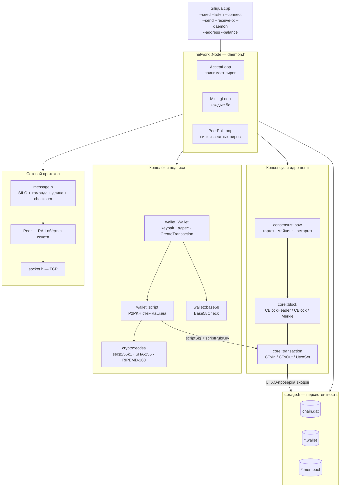
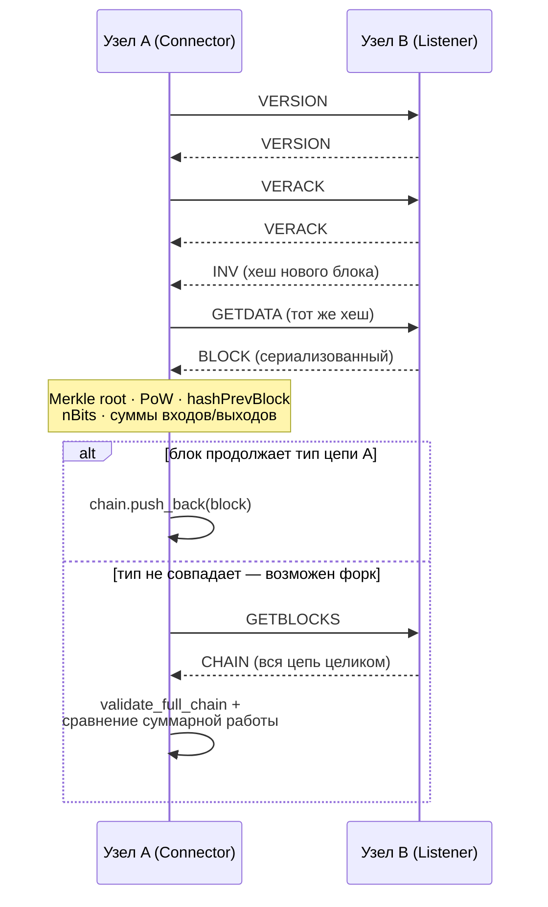
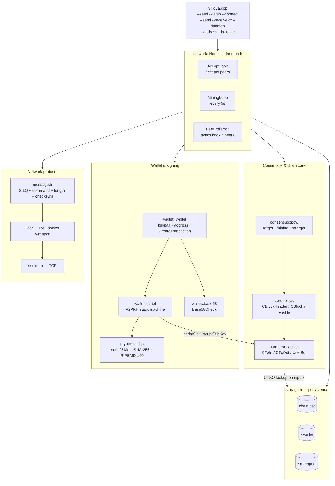

# Siliqua

**C++ Bitcoin-like blockchain prototype** — своя реализация UTXO, Proof-of-Work, P2PKH-скриптов, secp256k1-подписей и бинарного P2P-протокола на чистом C++23, без внешних блокчейн-фреймворков.
**A Bitcoin-like blockchain prototype in C++** — a from-scratch implementation of UTXO, Proof-of-Work, P2PKH scripts, secp256k1 signatures, and a binary P2P protocol in plain C++23, with no external blockchain frameworks.

**Язык / Language:** 🇷🇺 [Русский](#русский) · 🇬🇧 [English](#english) · 👤 [Об авторе / About](#об-авторе--about-the-author)

Полная документация также доступна отдельными файлами в [`Siliqua/docs/`](Siliqua/docs/): [ARCHITECTURE.ru.md](Siliqua/docs/ARCHITECTURE.ru.md) / [ARCHITECTURE.en.md](Siliqua/docs/ARCHITECTURE.en.md) и **живые интерактивные HTML-схемы** (через GitHub Pages — открываются как обычная страница, не как исходный код): [architecture.ru.html](https://crypt0xCode.github.io/Siliqua/architecture.ru.html) / [architecture.en.html](https://crypt0xCode.github.io/Siliqua/architecture.en.html). Диаграммы ниже — те же самые, в виде Mermaid, который GitHub рендерит нативно прямо в этом файле.
The full write-up is also available as standalone files in [`Siliqua/docs/`](Siliqua/docs/): [ARCHITECTURE.ru.md](Siliqua/docs/ARCHITECTURE.ru.md) / [ARCHITECTURE.en.md](Siliqua/docs/ARCHITECTURE.en.md), and **live interactive HTML diagrams** (served via GitHub Pages, so they open as an actual page rather than raw source): [architecture.ru.html](https://crypt0xCode.github.io/Siliqua/architecture.ru.html) / [architecture.en.html](https://crypt0xCode.github.io/Siliqua/architecture.en.html). The diagrams below are the same ones, as Mermaid, which GitHub renders natively right in this file.

---

## Русский

### Чек-лист реализованных возможностей

#### Криптография и адреса
✅ Генерация keypair (secp256k1): seckey/pubkey/сжатый pubkey
✅ ECDSA-подпись и верификация подписи
✅ SHA-256 / двойной SHA-256 / RIPEMD-160 хеширование
✅ Вывод адреса из pubkey (RIPEMD160(SHA256(pubkey)))
✅ Base58Check-кодирование адресов (собственный version byte 0x1E)

#### Ядро цепи (core)
✅ Структуры транзакции: COutPoint, CTxIn, CTxOut, Transaction
✅ Двойной SHA-256 хеш транзакции и блока (GetHash)
✅ Сериализация/десериализация транзакций и блоков в бинарный формат
✅ Merkle Root и его проверка (IsMerkleRootValid)
✅ UTXO-модель (unordered_map<COutPoint, CTxOut> для O(1)-поиска)

#### Консенсус и экономика
✅ Proof-of-Work: компактный target (nBits) ↔ 256-битный target
✅ Майнинг блока (перебор nNonce, роллинг nTime при переполнении)
✅ Ретаргет сложности (аналог правила Bitcoin, клампинг [0.25x, 4x])
✅ Расчёт суммарной работы цепи (chain work) для выбора форка
✅ Полная валидация цепи с нуля (validate_full_chain)
✅ Комиссии (fee) как разница между суммой входов и выходов
✅ Halving награды за блок (аналог 210 000 блоков Bitcoin, уменьшенный масштаб)

#### Скрипты и кошелёк
✅ P2PKH scriptPubKey / scriptSig (OP_DUP, OP_HASH160, OP_EQUALVERIFY, OP_CHECKSIG)
✅ Стековая машина выполнения скриптов (script::evaluate)
✅ Класс Wallet: хранение ключей, адрес, сборка и подпись транзакций
✅ Выбор UTXO (greedy) с формированием сдачи и dust-порогом

#### Сетевой протокол (P2P)
✅ Собственный бинарный протокол поверх TCP (magic bytes "SILQ")
✅ Кадрирование сообщений: magic + команда + длина + checksum
✅ Команды: VERSION, VERACK, INV, GETDATA, BLOCK, TX, GETBLOCKS, CHAIN
✅ Класс Peer (RAII-обёртка сокета)
✅ Кроссплатформенные сокеты (Winsock/POSIX) через единый интерфейс

#### Узел (Node) и демон
✅ Разовые CLI-операции: run_listener, run_connector, run_send_tx, run_receive_tx
✅ Постоянный многопоточный демон (network::Node): AcceptLoop, MiningLoop, PeerPollLoop
✅ Мемпул с ограничением размера (MAX_MEMPOOL_SIZE)
✅ Приём и валидация чужих блоков, продолжение цепи (try_extend_chain)
✅ Разрешение форков по суммарной работе (try_reorg), а не по длине цепи
✅ Мультипир-режим демона (список известных пиров, периодическая синхронизация)

#### Хранилище
✅ Бинарная (де)сериализация всей цепи в файл
✅ Персистентность UTXO-сета в файл
✅ Персистентность мемпула в файл
✅ Персистентность кошелька (seckey) в файл, восстановление между запусками

#### CLI
✅ `--seed`, `--listen`, `--connect`, `--address`, `--balance`, `--send`, `--receive-tx`, `--daemon`

#### Сборка
✅ Кроссплатформенный CMake (Windows/Linux/macOS), C++23
✅ Поиск secp256k1 и Crypto++ через pkg-config / vcpkg-style libs
✅ Оптимизация под слабое/старое железо (-O2 вместо -O3)

---

### Глава 1: Введение

#### Название проекта
Siliqua — прототип одноранговой (P2P) блокчейн-платформы в духе Bitcoin, написанный на чистом C++ без внешних блокчейн-фреймворков.

#### Цель проекта
Воспроизвести ключевые архитектурные и алгоритмические паттерны Bitcoin (UTXO, Proof-of-Work, P2P-протокол, скрипты, halving, комиссии) в компактной, читаемой кодовой базе, оптимизированной для запуска на слабом/старом оборудовании.

#### Технологический стек

| Компонент             | Технологии                                                         |
| ---------------------- | ------------------------------------------------------------------- |
| Язык / стандарт        | C++23                                                                |
| Криптография (ECDSA)   | libsecp256k1                                                        |
| Хеширование            | picosha2 (SHA-256), Crypto++ (RIPEMD-160)                           |
| Сеть                   | сырые TCP-сокеты (POSIX / Winsock), собственный бинарный протокол   |
| Логирование            | spdlog                                                               |
| Сборка                 | CMake ≥ 3.15, кроссплатформенно (Windows / Linux / macOS)            |
| Хранилище              | плоские бинарные файлы (chain.dat, *.wallet, *.mempool)             |

#### Основные функции платформы
- Генерация кошелька (keypair secp256k1) и Base58Check-адреса
- Отправка и приём подписанных транзакций с комиссией
- Майнинг блоков с Proof-of-Work и наградой за блок (с halving)
- Проверка входящих блоков и транзакций (подписи, UTXO, суммы)
- Разрешение форков по суммарной работе цепи (а не по длине)
- Постоянно работающий узел (демон), синхронизирующийся с несколькими пирами
- Персистентность цепи, UTXO, мемпула и кошелька между запусками

#### Пройденные этапы разработки
На основе истории коммитов репозитория:

| Этап                                       | Ключевые результаты |
| -------------------------------------------- | -------------------- |
| Инициализация проекта, кроссплатформенный CMake | Windows/Linux/macOS сборка |
| Криптографический слой                     | ECDSA (seckey/pubkey/подпись/верификация), генерация адреса |
| Ядро: транзакции и блоки                   | COutPoint/CTxIn/CTxOut, CBlockHeader/CBlock, Merkle Root |
| Consensus: Proof-of-Work                   | compact target ↔ 256-бит, майнинг, проверка PoW |
| Персистентность                            | сериализация/десериализация цепи и UTXO в файлы |
| P2P-протокол                               | сообщения, рукопожатие VERSION/VERACK, сокеты |
| Первый обмен блоками между узлами          | Listener/Connector, генератор тестовых транзакций |
| Кошельки и подписи                         | класс Wallet, генератор уникальных кошельков, отдельные UTXO по адресам |
| Экономика сети                             | комиссии, halving, лимит мемпула |
| Реальные скрипты Bitcoin                   | scriptPubKey/scriptSig, стековая машина P2PKH |
| Мультипир-демон                            | многопоточный Node (Accept/Mining/PeerPoll), Base58-адреса |

---

### Глава 2: Архитектурная схема

Прототип блокчейна в духе Bitcoin: собственный формат блоков и транзакций, Proof-of-Work с ретаргетом сложности, UTXO-модель со скриптами P2PKH, secp256k1-подписи и бинарный P2P-протокол поверх сырых TCP-сокетов — без единой внешней ноды или блокчейн-фреймворка.

#### Компоненты системы
- **CLI (`Siliqua.cpp`):** разбор флагов запуска, диспетчеризация на разовые операции или демон.
- **`network::Node` (демон, `daemon.h`):** три потока — приём пиров, майнинг по таймеру, опрос известных пиров, общая цепь под `std::mutex`.
- **Consensus (`consensus/pow.h`):** compact target, майнинг, ретаргет сложности, суммарная работа цепи.
- **Core (`core/block.h`, `core/transaction.h`):** структуры блока и транзакции, Merkle Root, UTXO-сет.
- **Wallet (`wallet/*.h`):** ключи, адреса (Base58Check), сборка и подпись транзакций, P2PKH-скрипты.
- **Crypto (`crypto/ecdsa.h`):** обёртка над secp256k1 и хеш-функциями.
- **Network (`network/*.h`):** кадрирование сообщений, TCP-сокеты, класс `Peer`.
- **Storage (`storage/storage.h`):** бинарная персистентность цепи/UTXO/мемпула/кошелька в файлы.

#### Граф зависимостей и потоков управления



**Легенда:** узлы — модули/классы кодовой базы; сплошные стрелки — прямые вызовы/зависимости; пунктирная стрелка `-->|label|` — проверка/сверка данных между слоями; прямоугольник-цилиндр — файл на диске.

#### Модули по слоям

| Файл                          | Слой                    | Что делает |
| ------------------------------- | ------------------------ | ------------ |
| `consensus/pow.h`               | Proof-of-Work            | Компактная сложность → 256-битный таргет, майнинг перебором nNonce, ретаргет каждые 5 блоков (цель — 60с), суммарная работа цепи для выбора форка. |
| `core/block.h` · `transaction.h`| Блоки и UTXO             | Заголовок из 6 полей, double-SHA256 хеш, Merkle Root по транзакциям; UTXO — `unordered_map<COutPoint, CTxOut>` для O(1)-поиска входов. |
| `wallet/script.h`               | Скрипты P2PKH            | Стековая машина на 4 опкодах (DUP, HASH160, EQUALVERIFY, CHECKSIG) — тот же принцип, что и в реальном Bitcoin Script, но только необходимый минимум. |
| `wallet/base58.h`               | Адреса Base58Check       | RIPEMD160(SHA256(pubkey)) + версия-байт 0x1E + 4-байтная контрольная сумма — собственный префикс, отличный от настоящего Bitcoin. |
| `network/message.h`             | Кадрирование сообщений   | Magic `SILQ` + команда (12 байт) + длина + 4-байтная checksum (double-SHA256 payload) — защита от чужого и повреждённого трафика. |
| `network/daemon.h`              | Постоянный узел          | Три потока вокруг одной цепи под `std::mutex`: приём пиров, майнинг по таймеру, опрос известных пиров — без внешнего планировщика. |

#### Рукопожатие и обмен блоком между двумя узлами

Тот же цикл запросов, что использует `run_connector`: если полученный блок не продолжает собственный тип цепи, узел не отбрасывает его сразу — запрашивает всю цепь пира и сравнивает суммарную работу (правило Bitcoin: побеждает не самая длинная цепь, а цепь с наибольшей работой).



#### Основные модули-«контроллеры»
- **`network::Node` (`daemon.h`):** постоянный демон — приём соединений, майнинг, синхронизация с пирами.
- **`run_listener` / `run_connector` (`node.h`):** разовый обмен одним блоком между двумя узлами (используется CLI-флагами `--listen`/`--connect`).
- **`run_send_tx` / `run_receive_tx` (`node.h`):** отправка подписанной транзакции пиру / приём транзакции в мемпул.
- **`storage::*` (`storage.h`):** сохранение и загрузка цепи, UTXO-сета, мемпула.

Полная таблица экономических констант, показанных на диаграммах, — в [Главе 10](#глава-10-экономика-и-лимиты-сети).

---

### Глава 3: Криптография и адреса

#### Хеш-функции и подпись (`crypto/ecdsa.h`)
```cpp
namespace crypto {
    inline void hash_sha256(const std::vector<uint8_t>& input, std::array<uint8_t, 32>& output);
    inline void hash_double_sha256(const std::vector<uint8_t>& input, std::array<uint8_t, 32>& output);
    inline void hash_ripemd160(unsigned char* ripemd160_hash, unsigned char* input, size_t len);

    int generate_keypair(std::string input, std::vector<std::string>& keypair,
        unsigned char* seckey, secp256k1_pubkey& pubkey, unsigned char* compressed_pubkey);
    int create_address_from_pubkey(unsigned char* compressed_pubkey,
        unsigned char* ripemd160_hash, std::string& ripemd160_hash_string);
    int generate_sign(std::string input, unsigned char* seckey,
        unsigned char* serialized_signature, std::string& str_signature,
        secp256k1_ecdsa_signature& sig, unsigned char* input_hash);
    int verify_sign(secp256k1_ecdsa_signature& sig, unsigned char* serialized_signature,
        secp256k1_pubkey& pubkey, unsigned char* compressed_pubkey, unsigned char* input_hash);
}
```
Адрес = `RIPEMD160(SHA256(compressed_pubkey))`, 20 байт (`wallet::ADDRESS_SIZE`).

#### Base58Check-адреса (`wallet/base58.h`)
Тот же алгоритм, что и в реальном Bitcoin: алфавит без похожих символов (0/O, I/l) + контрольная сумма для защиты от опечаток. Собственный version byte, чтобы адрес Siliqua никогда не спутать с настоящим Bitcoin-адресом:
```cpp
constexpr uint8_t ADDRESS_VERSION_BYTE = 0x1E;

inline std::string encode_address(const std::array<uint8_t, ADDRESS_SIZE>& address) {
    std::vector<uint8_t> payload;
    payload.push_back(ADDRESS_VERSION_BYTE);
    payload.insert(payload.end(), address.begin(), address.end());

    std::array<uint8_t, 32> checksum{};
    crypto::hash_double_sha256(payload, checksum);
    payload.insert(payload.end(), checksum.begin(), checksum.begin() + 4);

    return base58_encode(payload);
}
```
`decode_address()` — обратная операция, с проверкой версии и контрольной суммы (бросает исключение при опечатке).

#### Подпись сообщений (`wallet/signing.h`)
```cpp
constexpr size_t SIGNATURE_SIZE = 64; // secp256k1 compact signature
constexpr size_t PUBKEY_SIZE = 33;    // сжатый pubkey

std::vector<uint8_t> sign_raw(const unsigned char seckey[32], const std::array<uint8_t, 32>& sighash);
bool verify_raw_signature(const std::vector<uint8_t>& sig_bytes,
    const std::vector<uint8_t>& pubkey_bytes, const std::array<uint8_t, 32>& sighash);
```
Подписывается хеш транзакции, посчитанный **при всех пустых `scriptSig`** (аналог `SIGHASH_ALL` в Bitcoin) — подпись не может зависеть от собственных байт.

---

### Глава 4: Транзакции и UTXO-модель

#### Структуры (`core/transaction.h`)

| Структура     | Поля                                               | Назначение                              |
| ------------- | ---------------------------------------------------- | ----------------------------------------- |
| `COutPoint`   | `txid[32]`, `n`                                       | указатель на конкретный выход прошлой tx |
| `CTxIn`       | `prevout`, `scriptSig`, `nSequence`                   | вход — тратит один UTXO                  |
| `CTxOut`      | `nValue` (сатоши), `scriptPubKey`                     | выход — новый неподтверждённый остаток   |
| `Transaction` | `nVersion`, `vin`, `vout`, `nLockTime`, `tx_hash`     | вся транзакция                           |

```cpp
// outpoint -> unspent output. O(1)-поиск вместо O(log n) у std::map —
// именно эта структура сильнее всего нагружается по мере роста цепи.
using UtxoSet = std::unordered_map<COutPoint, CTxOut, COutPointHash>;
```

#### Хеш и Coinbase
```cpp
std::array<uint8_t, 32> Transaction::GetHash() const;  // двойной SHA-256 сериализованной tx
bool Transaction::IsCoinbase() const;                    // первая tx в блоке — награда майнеру
```

#### Построение UTXO-сета из всей цепи (`network/node.h`)
```cpp
inline transaction::UtxoSet build_utxo_set(const std::vector<block::CBlock>& chain) {
    transaction::UtxoSet utxos;
    for (const auto& blk : chain)
        for (const auto& tx : blk.vtx)
            for (uint32_t i = 0; i < tx.vout.size(); ++i)
                utxos.emplace(transaction::COutPoint(tx.tx_hash, i), tx.vout.at(i));
    for (const auto& blk : chain)
        for (const auto& tx : blk.vtx)
            for (const auto& in : tx.vin)
                utxos.erase(in.prevout);
    return utxos;
}
```

#### Проверка транзакции и вычисление комиссии
```cpp
// fee (>= 0), если tx валидна; -1, если нет.
inline int64_t validate_and_get_fee(const transaction::Transaction& tx, const transaction::UtxoSet& utxo_set) {
    int64_t input_total = 0;
    for (size_t i = 0; i < tx.vin.size(); ++i) {
        auto it = utxo_set.find(tx.vin.at(i).prevout);
        if (it == utxo_set.end() || !wallet::verify_transaction_signature(tx, i, it->second.scriptPubKey))
            return -1;
        input_total += it->second.nValue;
    }
    int64_t output_total = 0;
    for (const auto& out : tx.vout) output_total += out.nValue;
    if (output_total > input_total) return -1;
    return input_total - output_total; // разница = комиссия
}
```

---

### Глава 5: Блоки и Proof-of-Work

#### Заголовок блока (`core/block.h`)
```cpp
struct CBlockHeader {
    int32_t nVersion;
    std::array<uint8_t, 32> hashPrevBlock;
    std::array<uint8_t, 32> hashMerkleRoot;
    uint32_t nTime;
    uint32_t nBits;   // компактный target
    uint32_t nNonce;

    std::array<uint8_t, 32> GetHash() const; // двойной SHA-256
};

class CBlock : public CBlockHeader {
public:
    std::vector<transaction::Transaction> vtx;
    std::array<uint8_t, 32> BuildMerkleRoot() const;
    bool IsMerkleRootValid() const;
    bool IsValid() const;
};
```

#### Compact target ↔ 256-бит (`consensus/pow.h`)
Верхний байт `nBits` — экспонента (длина в байтах), младшие 3 байта — мантисса. Та же схема, что и в Bitcoin:
```cpp
inline std::array<uint8_t, 32> bits_to_target(uint32_t bits);
inline bool check_proof_of_work(const block::CBlockHeader& header); // hash <= target
inline void mine_block(block::CBlockHeader& header, uint32_t nBitsTarget); // перебор nNonce
```

#### Ретаргет сложности
```cpp
constexpr uint32_t RETARGET_INTERVAL = 5;         // блоков между пересчётами
constexpr uint32_t TARGET_TIMESPAN_SECONDS = 60;  // ожидаемое время на интервал
constexpr uint32_t INITIAL_BITS = 0x207fffff;

// actual_timespan клампится в [target/4, target*4] — всплеск быстрых/медленных
// блоков не может сдвинуть сложность больше чем в 4 раза за один ретаргет.
uint32_t get_next_work_required(const std::vector<block::CBlockHeader>& headers,
    uint32_t retarget_interval, uint32_t target_timespan_seconds);
```

#### Выбор форка — по суммарной работе, а не по длине
```cpp
double calculate_block_work(uint32_t nBits);              // 2^256 / target
double calculate_chain_work(const std::vector<block::CBlockHeader>& headers);
```
Ключевое правило Bitcoin, воспроизведённое здесь: побеждает цепь с наибольшей **суммарной работой** (`try_reorg` в `node.h`), а не просто более длинная — обычно это совпадает, но не всегда.

#### Награда за блок и halving (`network/node.h`)
```cpp
constexpr int64_t INITIAL_REWARD = 5000000000; // 50 монет, блок 0
constexpr uint32_t HALVING_INTERVAL = 10;       // блоков на halving (для наглядности теста)

inline int64_t calculate_block_reward(uint32_t height) {
    uint32_t halvings = height / HALVING_INTERVAL;
    if (halvings >= 63) return 0;
    return INITIAL_REWARD >> halvings;
}
```
Coinbase-вход кодирует высоту блока в `scriptSig` (аналог Bitcoin BIP34) — иначе два блока с одинаковой наградой от одного адреса дали бы идентичный `tx_hash` и столкнулись бы в UTXO-сете.

---

### Глава 6: Скрипты P2PKH

#### Опкоды (`wallet/script.h`)

| Опкод            | Код    | Действие                                                    |
| ----------------- | ------ | -------------------------------------------------------------- |
| `OP_DUP`          | `0x76` | дублирует верх стека                                          |
| `OP_HASH160`      | `0xa9` | `RIPEMD160(SHA256(x))` верха стека                             |
| `OP_EQUALVERIFY`  | `0x88` | сравнивает два верхних элемента, обрывает при несовпадении     |
| `OP_CHECKSIG`     | `0xac` | проверяет подпись против sighash                                |

#### Построение скриптов
```cpp
// OP_DUP OP_HASH160 <push 20-byte address> OP_EQUALVERIFY OP_CHECKSIG
std::vector<uint8_t> build_p2pkh_script_pubkey(const std::array<uint8_t, wallet::ADDRESS_SIZE>& address);

// <push signature><push pubkey>
std::vector<uint8_t> build_script_sig(const std::vector<uint8_t>& signature, const std::vector<uint8_t>& pubkey);
```

#### Выполнение (стековая машина)
`scriptSig` и `scriptPubKey` конкатенируются и выполняются как одна программа — так же, как в настоящем Bitcoin. Трата валидна, если на стеке в конце остаётся ровно одно истинное значение:
```cpp
bool evaluate(const std::vector<uint8_t>& script_sig,
    const std::vector<uint8_t>& script_pubkey, const std::array<uint8_t, 32>& sighash);
```
Это не полный Bitcoin Script (~100 опкодов), а минимум, необходимый для классического P2PKH.

---

### Глава 7: Сетевой протокол (P2P)

#### Формат кадра сообщения (`network/message.h`)

| Поле       | Размер     | Описание                                          |
| ----------- | ---------- | ------------------------------------------------------ |
| magic       | 4 байта    | `"SILQ"` — не спутать с реальным Bitcoin-трафиком      |
| command     | 12 байт    | имя команды, дополненное нулями                        |
| length      | 4 байта LE | длина payload                                           |
| checksum    | 4 байта    | первые 4 байта double-SHA256(payload)                   |
| payload     | переменная | тело сообщения                                          |

```cpp
inline constexpr std::array<uint8_t, 4> MAGIC_BYTES = { 'S', 'I', 'L', 'Q' };
inline constexpr uint32_t MAX_PAYLOAD_SIZE = 4 * 1024 * 1024; // защита от враждебного length
```

#### Команды протокола

| Команда      | Направление                        | Назначение                                     |
| ------------- | ------------------------------------ | ------------------------------------------------- |
| `version`     | инициатор → получатель               | согласование версии протокола                     |
| `verack`      | получатель → инициатор               | подтверждение рукопожатия                          |
| `inv`         | listener → connector                 | анонс хеша нового блока                            |
| `getdata`     | connector → listener                 | запрос блока по хешу                               |
| `block`       | listener → connector                 | сериализованный блок                               |
| `tx`          | отправитель → получатель             | подписанная транзакция для мемпула                 |
| `getblocks`   | connector → listener                 | запрос всей цепи (для разрешения форка)            |
| `chain`       | listener → connector                 | вся цепь целиком (`storage::serialize_chain`)      |

#### Класс Peer — RAII-обёртка сокета (`network/peer.h`)
```cpp
class Peer {
public:
    explicit Peer(socket_t sock) : sock_(sock) {}
    ~Peer() { close_socket(sock_); }
    Peer(const Peer&) = delete; // у сокета ровно один владелец

    bool Send(const std::string& cmd, const std::vector<uint8_t>& payload) const;
    bool Receive(Message& out) const;
};
```
Сокеты кроссплатформенные (`network/socket.h`): Winsock на Windows, стандартные POSIX-сокеты на Linux/macOS через единый интерфейс `create_listener` / `connect_to` / `accept_connection`.

---

### Глава 8: Узел — CLI-режимы и постоянный демон

#### Разовые операции (`network/node.h`)
Каждая функция выполняет ровно один обмен с ровно одним пиром и завершается — удобно для CLI и тестирования:

| Функция              | Что делает                                                                       |
| ---------------------- | ----------------------------------------------------------------------------------- |
| `run_listener`         | добывает новый блок поверх своей цепи, слушает порт, обслуживает одного пира       |
| `run_connector`        | подключается к пиру, забирает блок; если он не продолжает свой тип — запрашивает всю цепь пира и сравнивает суммарную работу |
| `run_send_tx`          | собирает и подписывает транзакцию из своих UTXO, отправляет пиру в мемпул          |
| `run_receive_tx`       | принимает одну транзакцию, проверяет подпись/UTXO, кладёт в мемпул                |

#### Постоянный демон `network::Node` (`network/daemon.h`)
Те же строительные блоки (`build_next_block`, `try_extend_chain`, `try_reorg`, `validate_and_get_fee`), но работающие непрерывно, а не один раз:

```cpp
class Node {
public:
    Node(uint16_t listen_port, const std::string& chain_path, std::vector<PeerAddress> known_peers);
    [[noreturn]] void Run(); // запускает 3 потока и никогда не возвращает управление

private:
    [[noreturn]] void AcceptLoop();    // принимает пиров, каждого — в отдельном detached-потоке
    void HandleConnection(socket_t client_sock);
    void AcceptTransaction(const transaction::Transaction& tx, const std::string& prefix);
    [[noreturn]] void MiningLoop();    // раз в DAEMON_CYCLE_SECONDS добывает блок из мемпула
    [[noreturn]] void PeerPollLoop();  // раз в DAEMON_CYCLE_SECONDS опрашивает known_peers_
    void PollPeer(const PeerAddress& addr);

    std::mutex mutex_;                 // защищает chain_ от гонок между тремя циклами
    std::vector<block::CBlock> chain_;
};
```

#### Приём блока и разрешение форка
```cpp
bool try_extend_chain(std::vector<block::CBlock>& chain, const block::CBlock& received_block);
bool try_reorg(std::vector<block::CBlock>& chain, const std::vector<block::CBlock>& peer_chain);
bool validate_full_chain(const std::vector<block::CBlock>& chain); // с нуля, от genesis
```
Полная последовательность обмена показана на диаграмме в [Главе 2](#глава-2-архитектурная-схема) (рукопожатие и обмен блоком).

---

### Глава 9: Хранилище (`storage/storage.h`)

| Файл                    | Формат                                                                       |
| ------------------------- | --------------------------------------------------------------------------- |
| `<chain_path>`             | количество блоков (varint) + `Serialize()` каждого блока подряд             |
| `<chain_path>.wallet`      | 32 сырых байта seckey                                                       |
| `<chain_path>.mempool`     | количество tx (varint) + `Serialize()` каждой транзакции подряд             |
| `<любой>.utxo`             | количество записей (varint) + пары `COutPoint::Serialize()`+`CTxOut::Serialize()` |

```cpp
void save_chain(const std::vector<block::CBlock>& chain, const std::string& path);
std::vector<block::CBlock> load_chain(const std::string& path);
void save_mempool(const std::vector<transaction::Transaction>& mempool, const std::string& path);
std::vector<transaction::Transaction> load_mempool(const std::string& path);
```
Один и тот же `serialize_chain()`/`deserialize_chain()` используется и для файла, и для сетевого сообщения `CHAIN` — один формат, два носителя.

---

### Глава 10: Экономика и лимиты сети

| Константа                  | Значение          | Смысл                                                     | Файл                  |
| ---------------------------- | ------------------ | ------------------------------------------------------------ | ----------------------- |
| `INITIAL_REWARD`             | 5 000 000 000      | 50 монет — награда за блок 0, до halving                     | `network/node.h`        |
| `HALVING_INTERVAL`           | 10 блоков          | награда делится пополам каждые N блоков                      | `network/node.h`        |
| `DEFAULT_FEE`                | 1000 сатоши        | фиксированная комиссия `run_send_tx`                          | `network/node.h`        |
| `RETARGET_INTERVAL`          | 5 блоков           | как часто пересчитывается сложность                          | `network/node.h`        |
| `TARGET_TIMESPAN_SECONDS`    | 60 с               | ожидаемое время на `RETARGET_INTERVAL` блоков                 | `network/node.h`        |
| `MAX_MEMPOOL_SIZE`           | 1000 tx            | потолок неподтверждённых транзакций                           | `network/node.h`        |
| `DUST_THRESHOLD`             | 1000 сатоши        | сдача меньше этого не выделяется в отдельный UTXO             | `wallet/wallet.h`       |
| `DAEMON_CYCLE_SECONDS`       | 5 с                | период циклов MiningLoop и PeerPollLoop                       | `network/daemon.h`      |
| `ADDRESS_VERSION_BYTE`       | `0x1E`             | собственный префикс адреса (не Bitcoin mainnet)               | `wallet/base58.h`       |
| `MAGIC_BYTES`                | `"SILQ"`           | отличает трафик Siliqua от настоящего Bitcoin P2P              | `network/message.h`     |

Значения намеренно небольшие (halving за 10 блоков, ретаргет за 5) — поведение можно наблюдать за один тестовый прогон, а не за годы, как в реальном Bitcoin.

---

### Глава 11: CLI — команды и сценарий из двух узлов

#### Справка по флагам (`src/Siliqua.cpp`)

| Команда                                                          | Назначение                                                        |
| -------------------------------------------------------------------- | ------------------------------------------------------------------ |
| `Siliqua --seed <path>`                                              | добыть чистую genesis-цепь (нейтральный адрес) и сохранить         |
| `Siliqua --listen <port> [chain_path]`                                | добыть блок поверх `chain_path`, обслужить одного пира             |
| `Siliqua --connect <host> <port> [chain_path]`                        | забрать блок у пира и, если валиден, добавить в `chain_path`       |
| `Siliqua --address <chain_path>`                                      | напечатать адрес кошелька узла (Base58Check)                       |
| `Siliqua --balance <chain_path>`                                      | напечатать свои UTXO и их сумму                                    |
| `Siliqua --send <host> <port> <chain_path> <address> <amount>`        | подписать трату и отправить пиру в мемпул                          |
| `Siliqua --receive-tx <port> <chain_path>`                            | принять одну транзакцию от пира в мемпул                           |
| `Siliqua --daemon <port> <chain_path> [host:port ...]`                | запустить постоянный узел с (опционально) известными пирами        |

#### Практический сценарий: два узла, один перевод
```bash
# 1. Узел A сеет genesis-цепь
./Siliqua --seed nodeA.dat

# 2. Узел B копирует ТОТ ЖЕ genesis ДО того, как A замайнит следующий блок —
#    run_connector требует уже существующую цепь с общим genesis, иначе
#    первый же полученный блок не свяжется по hashPrevBlock и будет отклонён.
cp nodeA.dat nodeB.dat

# 3. Узел A добывает блок 1 поверх своей цепи и слушает порт 9000
./Siliqua --listen 9000 nodeA.dat &

# 4. Узел B подключается, забирает блок 1 и дописывает его в свою копию цепи
./Siliqua --connect 127.0.0.1 9000 nodeB.dat

# 5. Смотрим адреса и баланс узла A (награда за блок 1 ушла на его кошелёк)
./Siliqua --address nodeA.dat
./Siliqua --address nodeB.dat
./Siliqua --balance nodeA.dat

# 6. Узел B слушает порт для приёма транзакции
./Siliqua --receive-tx 9001 nodeB.dat &

# 7. Узел A отправляет часть своего баланса на адрес узла B (адрес из шага 5)
./Siliqua --send 127.0.0.1 9001 nodeA.dat <адрес_узла_B> 100000

# 8. Постоянный демон вместо разовых команд, с известным пиром
./Siliqua --daemon 9000 nodeA.dat 127.0.0.1:9001
```

---

### Глава 12: Сборка проекта

#### Зависимости
- CMake ≥ 3.15, компилятор с поддержкой C++23
- `libsecp256k1` (`brew install secp256k1` / `apt-get install libsecp256k1-dev`)
- `libcryptopp` (`brew install cryptopp` / `apt-get install libcrypto++-dev`)
- На Windows зависимости ожидаются в `Siliqua/libs/` (`libsecp256k1.lib`, `cryptlib.lib`)

#### Сборка (Linux / macOS)
```bash
mkdir -p build && cd build
cmake ..
cmake --build . --config Release
```
Бинарник появляется в `Siliqua/bin/Siliqua` (`RUNTIME_OUTPUT_DIRECTORY`).

#### Особенности CMakeLists.txt
```cmake
set(CMAKE_CXX_STANDARD 23)
set(CMAKE_CXX_STANDARD_REQUIRED ON)

# Однопроходные генераторы (Make/Ninja) по умолчанию не оптимизируют, если
# не указан build type явно - форсируем Release, чтобы `cmake .. && cmake --build .`
# сразу давал оптимизированный бинарник.
if(NOT CMAKE_BUILD_TYPE AND NOT CMAKE_CONFIGURATION_TYPES)
    set(CMAKE_BUILD_TYPE Release CACHE STRING "Build type" FORCE)
endif()
```
`-O2` вместо `-O3` на GCC/Clang в Release — сознательный выбор ради совместимости со слабым/старым железом (без автовекторизации под инструкции, которых может не быть на целевом CPU).

#### Threads
`network/daemon.h` использует `std::thread`; на Linux это требует `-lpthread`, что решается через `Threads::Threads` вместо ручного флага, специфичного для платформы.

---

## English

### Checklist of implemented features

#### Cryptography and addresses
✅ Keypair generation (secp256k1): seckey/pubkey/compressed pubkey
✅ ECDSA signing and signature verification
✅ SHA-256 / double SHA-256 / RIPEMD-160 hashing
✅ Address derivation from a pubkey (RIPEMD160(SHA256(pubkey)))
✅ Base58Check address encoding (own version byte 0x1E)

#### Chain core (core)
✅ Transaction structures: COutPoint, CTxIn, CTxOut, Transaction
✅ Double SHA-256 hash of transactions and blocks (GetHash)
✅ Binary serialization/deserialization of transactions and blocks
✅ Merkle Root and its verification (IsMerkleRootValid)
✅ UTXO model (unordered_map<COutPoint, CTxOut> for O(1) lookups)

#### Consensus and economics
✅ Proof-of-Work: compact target (nBits) ↔ 256-bit target
✅ Block mining (brute-forcing nNonce, rolling nTime on overflow)
✅ Difficulty retargeting (same rule as Bitcoin, clamped to [0.25x, 4x])
✅ Total chain work calculation for fork selection
✅ Full from-scratch chain validation (validate_full_chain)
✅ Fees as the difference between input and output sums
✅ Block reward halving (same idea as Bitcoin's 210,000 blocks, on a smaller scale)

#### Scripts and wallet
✅ P2PKH scriptPubKey / scriptSig (OP_DUP, OP_HASH160, OP_EQUALVERIFY, OP_CHECKSIG)
✅ Stack machine for script execution (script::evaluate)
✅ Wallet class: key storage, address, building and signing transactions
✅ UTXO selection (greedy) with change output and a dust threshold

#### P2P network protocol
✅ Own binary protocol over TCP (magic bytes "SILQ")
✅ Message framing: magic + command + length + checksum
✅ Commands: VERSION, VERACK, INV, GETDATA, BLOCK, TX, GETBLOCKS, CHAIN
✅ Peer class (RAII socket wrapper)
✅ Cross-platform sockets (Winsock/POSIX) behind one interface

#### Node and daemon
✅ One-shot CLI operations: run_listener, run_connector, run_send_tx, run_receive_tx
✅ Persistent multi-threaded daemon (network::Node): AcceptLoop, MiningLoop, PeerPollLoop
✅ Size-capped mempool (MAX_MEMPOOL_SIZE)
✅ Accepting and validating peer blocks, extending the chain (try_extend_chain)
✅ Fork resolution by total work (try_reorg), not chain length
✅ Multi-peer daemon mode (list of known peers, periodic sync)

#### Storage
✅ Binary (de)serialization of the whole chain to a file
✅ UTXO set persistence to a file
✅ Mempool persistence to a file
✅ Wallet (seckey) persistence to a file, restored across runs

#### CLI
✅ `--seed`, `--listen`, `--connect`, `--address`, `--balance`, `--send`, `--receive-tx`, `--daemon`

#### Build
✅ Cross-platform CMake (Windows/Linux/macOS), C++23
✅ secp256k1 and Crypto++ discovery via pkg-config / vcpkg-style libs
✅ Optimized for weak/old hardware (-O2 instead of -O3)

---

### Chapter 1: Introduction

#### Project name
Siliqua is a peer-to-peer (P2P) blockchain platform prototype in the spirit of Bitcoin, written in plain C++ with no external blockchain frameworks.

#### Project goal
Reproduce Bitcoin's key architectural and algorithmic patterns (UTXO, Proof-of-Work, the P2P protocol, scripts, halving, fees) in a compact, readable codebase optimized to run on weak/old hardware.

#### Technology stack

| Component               | Technology                                                          |
| ------------------------- | ---------------------------------------------------------------------- |
| Language / standard       | C++23                                                                   |
| Cryptography (ECDSA)      | libsecp256k1                                                           |
| Hashing                   | picosha2 (SHA-256), Crypto++ (RIPEMD-160)                              |
| Networking                | raw TCP sockets (POSIX / Winsock), a custom binary protocol            |
| Logging                   | spdlog                                                                  |
| Build                     | CMake ≥ 3.15, cross-platform (Windows / Linux / macOS)                 |
| Storage                   | flat binary files (chain.dat, *.wallet, *.mempool)                     |

#### Core platform features
- Wallet generation (secp256k1 keypair) and Base58Check addresses
- Sending and receiving signed transactions with a fee
- Mining blocks with Proof-of-Work and a block reward (with halving)
- Validating incoming blocks and transactions (signatures, UTXOs, sums)
- Fork resolution by total chain work (not length)
- A persistently running node (daemon) syncing with multiple peers
- Persistence of the chain, UTXO set, mempool and wallet across runs

#### Development milestones
Based on the repository's commit history:

| Milestone                                    | Key results |
| ------------------------------------------------ | -------------- |
| Project bootstrap, cross-platform CMake         | Windows/Linux/macOS build |
| Cryptography layer                              | ECDSA (seckey/pubkey/sign/verify), address generation |
| Core: transactions and blocks                   | COutPoint/CTxIn/CTxOut, CBlockHeader/CBlock, Merkle Root |
| Consensus: Proof-of-Work                        | compact target ↔ 256-bit, mining, PoW check |
| Persistence                                     | chain and UTXO (de)serialization to files |
| P2P protocol                                    | messages, VERSION/VERACK handshake, sockets |
| First block exchange between nodes              | Listener/Connector, test transaction generator |
| Wallets and signing                             | Wallet class, unique wallet generator, per-address UTXOs |
| Network economics                               | fees, halving, mempool limit |
| Real Bitcoin scripts                            | scriptPubKey/scriptSig, P2PKH stack machine |
| Multi-peer daemon                               | multi-threaded Node (Accept/Mining/PeerPoll), Base58 addresses |

---

### Chapter 2: Architecture diagram

A Bitcoin-style blockchain prototype: a custom block and transaction format, Proof-of-Work with difficulty retargeting, a UTXO model with P2PKH scripts, secp256k1 signatures, and a binary P2P protocol over raw TCP sockets — no external node, no blockchain framework.

#### System components
- **CLI (`Siliqua.cpp`):** parses launch flags, dispatches to a one-shot operation or the daemon.
- **`network::Node` (daemon, `daemon.h`):** three threads — accepting peers, mining on a timer, polling known peers, one shared chain under `std::mutex`.
- **Consensus (`consensus/pow.h`):** compact target, mining, difficulty retargeting, total chain work.
- **Core (`core/block.h`, `core/transaction.h`):** block and transaction structures, Merkle Root, the UTXO set.
- **Wallet (`wallet/*.h`):** keys, addresses (Base58Check), building and signing transactions, P2PKH scripts.
- **Crypto (`crypto/ecdsa.h`):** a wrapper over secp256k1 and the hash functions.
- **Network (`network/*.h`):** message framing, TCP sockets, the `Peer` class.
- **Storage (`storage/storage.h`):** binary persistence of the chain/UTXO set/mempool/wallet to files.

#### Dependency graph and control-flow threads



**Legend:** nodes are modules/classes in the codebase; solid arrows are direct calls/dependencies; the dashed `-->|label|` arrow is a cross-layer check/lookup; the cylinder shape is a file on disk.

#### Modules by layer

| File                             | Layer                     | What it does |
| ----------------------------------- | --------------------------- | --------------- |
| `consensus/pow.h`                   | Proof-of-Work                | Compact difficulty → 256-bit target, mining by brute-forcing nNonce, a retarget every 5 blocks (60s target), total chain work decides forks. |
| `core/block.h` · `transaction.h`    | Blocks & UTXO                 | A 6-field header, double-SHA256 hash, Merkle Root over transactions; UTXO is an `unordered_map<COutPoint, CTxOut>` for O(1) input lookups. |
| `wallet/script.h`                   | P2PKH scripts                 | A stack machine with 4 opcodes (DUP, HASH160, EQUALVERIFY, CHECKSIG) — the same idea as real Bitcoin Script, just the necessary minimum. |
| `wallet/base58.h`                   | Base58Check addresses          | RIPEMD160(SHA256(pubkey)) + version byte 0x1E + a 4-byte checksum — its own prefix, distinct from real Bitcoin. |
| `network/message.h`                 | Message framing                | Magic `SILQ` + command (12 bytes) + length + a 4-byte checksum (double-SHA256 of the payload) — guards against foreign or corrupted traffic. |
| `network/daemon.h`                  | A persistent node              | Three threads around one chain under `std::mutex`: accepting peers, mining on a timer, polling known peers — no external scheduler. |

#### Handshake and block exchange between two nodes

The same request cycle `run_connector` uses: if the received block doesn't extend the node's own tip, it isn't dropped right away — the node requests the peer's whole chain and compares total work (Bitcoin's rule: the winner is the chain with the most work, not the longest one).


#### Main "controller" modules
- **`network::Node` (`daemon.h`):** the persistent daemon — accepting connections, mining, syncing with peers.
- **`run_listener` / `run_connector` (`node.h`):** a one-shot exchange of a single block between two nodes (used by the `--listen`/`--connect` CLI flags).
- **`run_send_tx` / `run_receive_tx` (`node.h`):** sending a signed transaction to a peer / receiving a transaction into the mempool.
- **`storage::*` (`storage.h`):** saving and loading the chain, the UTXO set, the mempool.

The full table of the economic constants shown on the diagrams is in [Chapter 10](#chapter-10-network-economics-and-limits).

---

### Chapter 3: Cryptography and addresses

#### Hash functions and signing (`crypto/ecdsa.h`)
```cpp
namespace crypto {
    inline void hash_sha256(const std::vector<uint8_t>& input, std::array<uint8_t, 32>& output);
    inline void hash_double_sha256(const std::vector<uint8_t>& input, std::array<uint8_t, 32>& output);
    inline void hash_ripemd160(unsigned char* ripemd160_hash, unsigned char* input, size_t len);

    int generate_keypair(std::string input, std::vector<std::string>& keypair,
        unsigned char* seckey, secp256k1_pubkey& pubkey, unsigned char* compressed_pubkey);
    int create_address_from_pubkey(unsigned char* compressed_pubkey,
        unsigned char* ripemd160_hash, std::string& ripemd160_hash_string);
    int generate_sign(std::string input, unsigned char* seckey,
        unsigned char* serialized_signature, std::string& str_signature,
        secp256k1_ecdsa_signature& sig, unsigned char* input_hash);
    int verify_sign(secp256k1_ecdsa_signature& sig, unsigned char* serialized_signature,
        secp256k1_pubkey& pubkey, unsigned char* compressed_pubkey, unsigned char* input_hash);
}
```
Address = `RIPEMD160(SHA256(compressed_pubkey))`, 20 bytes (`wallet::ADDRESS_SIZE`).

#### Base58Check addresses (`wallet/base58.h`)
The same algorithm real Bitcoin uses: an alphabet without look-alike characters (0/O, I/l) plus a checksum to catch typos. Its own version byte, so a Siliqua address is never mistaken for a real Bitcoin address:
```cpp
constexpr uint8_t ADDRESS_VERSION_BYTE = 0x1E;

inline std::string encode_address(const std::array<uint8_t, ADDRESS_SIZE>& address) {
    std::vector<uint8_t> payload;
    payload.push_back(ADDRESS_VERSION_BYTE);
    payload.insert(payload.end(), address.begin(), address.end());

    std::array<uint8_t, 32> checksum{};
    crypto::hash_double_sha256(payload, checksum);
    payload.insert(payload.end(), checksum.begin(), checksum.begin() + 4);

    return base58_encode(payload);
}
```
`decode_address()` is the reverse operation, checking the version byte and the checksum (throws on a typo).

#### Message signing (`wallet/signing.h`)
```cpp
constexpr size_t SIGNATURE_SIZE = 64; // secp256k1 compact signature
constexpr size_t PUBKEY_SIZE = 33;    // compressed pubkey

std::vector<uint8_t> sign_raw(const unsigned char seckey[32], const std::array<uint8_t, 32>& sighash);
bool verify_raw_signature(const std::vector<uint8_t>& sig_bytes,
    const std::vector<uint8_t>& pubkey_bytes, const std::array<uint8_t, 32>& sighash);
```
What gets signed is the transaction hash computed **with every `scriptSig` empty** (the same idea as Bitcoin's `SIGHASH_ALL`) — a signature cannot depend on its own bytes.

---

### Chapter 4: Transactions and the UTXO model

#### Structures (`core/transaction.h`)

| Structure     | Fields                                              | Purpose                                  |
| ------------- | ------------------------------------------------------ | ------------------------------------------- |
| `COutPoint`   | `txid[32]`, `n`                                          | pointer to a specific output of a past tx  |
| `CTxIn`       | `prevout`, `scriptSig`, `nSequence`                       | an input — spends one UTXO                |
| `CTxOut`      | `nValue` (satoshi), `scriptPubKey`                        | an output — new unconfirmed balance       |
| `Transaction` | `nVersion`, `vin`, `vout`, `nLockTime`, `tx_hash`         | the whole transaction                     |

```cpp
// outpoint -> unspent output. O(1) lookups instead of std::map's O(log n) -
// this is exactly the structure that gets hit hardest as the chain grows.
using UtxoSet = std::unordered_map<COutPoint, CTxOut, COutPointHash>;
```

#### Hash and coinbase
```cpp
std::array<uint8_t, 32> Transaction::GetHash() const;  // double SHA-256 of the serialized tx
bool Transaction::IsCoinbase() const;                    // the first tx in a block — the miner's reward
```

#### Building the UTXO set from the whole chain (`network/node.h`)
```cpp
inline transaction::UtxoSet build_utxo_set(const std::vector<block::CBlock>& chain) {
    transaction::UtxoSet utxos;
    for (const auto& blk : chain)
        for (const auto& tx : blk.vtx)
            for (uint32_t i = 0; i < tx.vout.size(); ++i)
                utxos.emplace(transaction::COutPoint(tx.tx_hash, i), tx.vout.at(i));
    for (const auto& blk : chain)
        for (const auto& tx : blk.vtx)
            for (const auto& in : tx.vin)
                utxos.erase(in.prevout);
    return utxos;
}
```

#### Validating a transaction and computing its fee
```cpp
// The fee (>= 0) if tx is valid; -1 otherwise.
inline int64_t validate_and_get_fee(const transaction::Transaction& tx, const transaction::UtxoSet& utxo_set) {
    int64_t input_total = 0;
    for (size_t i = 0; i < tx.vin.size(); ++i) {
        auto it = utxo_set.find(tx.vin.at(i).prevout);
        if (it == utxo_set.end() || !wallet::verify_transaction_signature(tx, i, it->second.scriptPubKey))
            return -1;
        input_total += it->second.nValue;
    }
    int64_t output_total = 0;
    for (const auto& out : tx.vout) output_total += out.nValue;
    if (output_total > input_total) return -1;
    return input_total - output_total; // the difference is the fee
}
```

---

### Chapter 5: Blocks and Proof-of-Work

#### Block header (`core/block.h`)
```cpp
struct CBlockHeader {
    int32_t nVersion;
    std::array<uint8_t, 32> hashPrevBlock;
    std::array<uint8_t, 32> hashMerkleRoot;
    uint32_t nTime;
    uint32_t nBits;   // compact target
    uint32_t nNonce;

    std::array<uint8_t, 32> GetHash() const; // double SHA-256
};

class CBlock : public CBlockHeader {
public:
    std::vector<transaction::Transaction> vtx;
    std::array<uint8_t, 32> BuildMerkleRoot() const;
    bool IsMerkleRootValid() const;
    bool IsValid() const;
};
```

#### Compact target ↔ 256-bit (`consensus/pow.h`)
The top byte of `nBits` is the exponent (byte length), the low 3 bytes are the mantissa — the same scheme Bitcoin uses:
```cpp
inline std::array<uint8_t, 32> bits_to_target(uint32_t bits);
inline bool check_proof_of_work(const block::CBlockHeader& header); // hash <= target
inline void mine_block(block::CBlockHeader& header, uint32_t nBitsTarget); // brute-forces nNonce
```

#### Difficulty retargeting
```cpp
constexpr uint32_t RETARGET_INTERVAL = 5;         // blocks between recalculations
constexpr uint32_t TARGET_TIMESPAN_SECONDS = 60;  // expected time for the interval
constexpr uint32_t INITIAL_BITS = 0x207fffff;

// actual_timespan is clamped to [target/4, target*4] - a burst of fast/slow
// blocks can't swing the difficulty by more than 4x in one retarget.
uint32_t get_next_work_required(const std::vector<block::CBlockHeader>& headers,
    uint32_t retarget_interval, uint32_t target_timespan_seconds);
```

#### Fork selection — by total work, not by length
```cpp
double calculate_block_work(uint32_t nBits);              // 2^256 / target
double calculate_chain_work(const std::vector<block::CBlockHeader>& headers);
```
Bitcoin's key rule, reproduced here: the chain with the greatest **total work** wins (`try_reorg` in `node.h`), not simply the longer one — the two usually coincide, but not always.

#### Block reward and halving (`network/node.h`)
```cpp
constexpr int64_t INITIAL_REWARD = 5000000000; // 50 coins, block 0
constexpr uint32_t HALVING_INTERVAL = 10;       // blocks per halving (small, so it's actually observable)

inline int64_t calculate_block_reward(uint32_t height) {
    uint32_t halvings = height / HALVING_INTERVAL;
    if (halvings >= 63) return 0;
    return INITIAL_REWARD >> halvings;
}
```
The coinbase input encodes the block height in `scriptSig` (the same idea as Bitcoin's BIP34) — otherwise two blocks with the same reward from the same address would produce an identical `tx_hash` and collide in the UTXO set.

---

### Chapter 6: P2PKH scripts

#### Opcodes (`wallet/script.h`)

| Opcode            | Code    | Action                                                    |
| ------------------- | ------ | -------------------------------------------------------------- |
| `OP_DUP`             | `0x76` | duplicates the top of the stack                                |
| `OP_HASH160`         | `0xa9` | `RIPEMD160(SHA256(x))` of the top of the stack                 |
| `OP_EQUALVERIFY`     | `0x88` | compares the top two elements, aborts on mismatch               |
| `OP_CHECKSIG`        | `0xac` | verifies a signature against the sighash                         |

#### Building scripts
```cpp
// OP_DUP OP_HASH160 <push 20-byte address> OP_EQUALVERIFY OP_CHECKSIG
std::vector<uint8_t> build_p2pkh_script_pubkey(const std::array<uint8_t, wallet::ADDRESS_SIZE>& address);

// <push signature><push pubkey>
std::vector<uint8_t> build_script_sig(const std::vector<uint8_t>& signature, const std::vector<uint8_t>& pubkey);
```

#### Execution (the stack machine)
`scriptSig` and `scriptPubKey` are concatenated and run as one program — the same way real Bitcoin does it. A spend is valid if the stack ends with exactly one truthy value:
```cpp
bool evaluate(const std::vector<uint8_t>& script_sig,
    const std::vector<uint8_t>& script_pubkey, const std::array<uint8_t, 32>& sighash);
```
This isn't the full Bitcoin Script language (~100 opcodes), just the minimum needed for classic P2PKH.

---

### Chapter 7: P2P network protocol

#### Message frame format (`network/message.h`)

| Field       | Size       | Description                                       |
| ----------- | ---------- | -------------------------------------------------------- |
| magic       | 4 bytes    | `"SILQ"` — not to be confused with real Bitcoin traffic  |
| command     | 12 bytes   | command name, zero-padded                                 |
| length      | 4 bytes LE | payload length                                             |
| checksum    | 4 bytes    | first 4 bytes of double-SHA256(payload)                    |
| payload     | variable   | the message body                                           |

```cpp
inline constexpr std::array<uint8_t, 4> MAGIC_BYTES = { 'S', 'I', 'L', 'Q' };
inline constexpr uint32_t MAX_PAYLOAD_SIZE = 4 * 1024 * 1024; // guards against a hostile length field
```

#### Protocol commands

| Command      | Direction                           | Purpose                                        |
| ------------- | ------------------------------------- | -------------------------------------------------- |
| `version`     | initiator → recipient                 | protocol version negotiation                        |
| `verack`      | recipient → initiator                 | handshake acknowledgement                            |
| `inv`         | listener → connector                  | announces the new block's hash                       |
| `getdata`     | connector → listener                  | requests a block by hash                              |
| `block`       | listener → connector                  | the serialized block                                  |
| `tx`          | sender → recipient                    | a signed transaction for the mempool                  |
| `getblocks`   | connector → listener                  | requests the whole chain (for fork resolution)        |
| `chain`       | listener → connector                  | the whole chain (`storage::serialize_chain`)          |

#### The Peer class — an RAII socket wrapper (`network/peer.h`)
```cpp
class Peer {
public:
    explicit Peer(socket_t sock) : sock_(sock) {}
    ~Peer() { close_socket(sock_); }
    Peer(const Peer&) = delete; // a socket has exactly one owner

    bool Send(const std::string& cmd, const std::vector<uint8_t>& payload) const;
    bool Receive(Message& out) const;
};
```
Sockets are cross-platform (`network/socket.h`): Winsock on Windows, standard POSIX sockets on Linux/macOS, behind one interface — `create_listener` / `connect_to` / `accept_connection`.

---

### Chapter 8: The node — CLI modes and the persistent daemon

#### One-shot operations (`network/node.h`)
Each function performs exactly one exchange with exactly one peer and exits — convenient for the CLI and for testing:

| Function              | What it does                                                                            |
| ---------------------- | -------------------------------------------------------------------------------------------- |
| `run_listener`         | mines a new block on top of its own chain, listens on a port, serves one peer               |
| `run_connector`        | connects to a peer, fetches a block; if it doesn't extend its own tip — requests the peer's whole chain and compares total work |
| `run_send_tx`          | builds and signs a transaction from its own UTXOs, sends it to a peer's mempool             |
| `run_receive_tx`       | accepts one transaction, checks its signature/UTXOs, drops it into the mempool              |

#### The persistent daemon `network::Node` (`network/daemon.h`)
The same building blocks (`build_next_block`, `try_extend_chain`, `try_reorg`, `validate_and_get_fee`), just running continuously instead of once:

```cpp
class Node {
public:
    Node(uint16_t listen_port, const std::string& chain_path, std::vector<PeerAddress> known_peers);
    [[noreturn]] void Run(); // starts 3 threads and never returns control

private:
    [[noreturn]] void AcceptLoop();    // accepts peers, each on its own detached thread
    void HandleConnection(socket_t client_sock);
    void AcceptTransaction(const transaction::Transaction& tx, const std::string& prefix);
    [[noreturn]] void MiningLoop();    // mines a block from the mempool every DAEMON_CYCLE_SECONDS
    [[noreturn]] void PeerPollLoop();  // polls known_peers_ every DAEMON_CYCLE_SECONDS
    void PollPeer(const PeerAddress& addr);

    std::mutex mutex_;                 // guards chain_ from races between the three loops
    std::vector<block::CBlock> chain_;
};
```

#### Accepting a block and fork resolution
```cpp
bool try_extend_chain(std::vector<block::CBlock>& chain, const block::CBlock& received_block);
bool try_reorg(std::vector<block::CBlock>& chain, const std::vector<block::CBlock>& peer_chain);
bool validate_full_chain(const std::vector<block::CBlock>& chain); // from scratch, from genesis
```
The full exchange sequence is shown in the diagram in [Chapter 2](#chapter-2-architecture-diagram) (handshake and block exchange).

---

### Chapter 9: Storage (`storage/storage.h`)

| File                     | Format                                                                        |
| --------------------------- | ---------------------------------------------------------------------------- |
| `<chain_path>`               | block count (varint) + each block's `Serialize()` back to back                |
| `<chain_path>.wallet`        | 32 raw bytes of the seckey                                                    |
| `<chain_path>.mempool`       | tx count (varint) + each transaction's `Serialize()` back to back             |
| `<any>.utxo`                 | entry count (varint) + pairs of `COutPoint::Serialize()`+`CTxOut::Serialize()`|

```cpp
void save_chain(const std::vector<block::CBlock>& chain, const std::string& path);
std::vector<block::CBlock> load_chain(const std::string& path);
void save_mempool(const std::vector<transaction::Transaction>& mempool, const std::string& path);
std::vector<transaction::Transaction> load_mempool(const std::string& path);
```
The same `serialize_chain()`/`deserialize_chain()` is used both for the file and for the network's `CHAIN` message — one format, two carriers.

---

### Chapter 10: Network economics and limits

| Constant                    | Value               | Meaning                                                    | File                    |
| ------------------------------ | -------------------- | -------------------------------------------------------------- | ------------------------- |
| `INITIAL_REWARD`               | 5,000,000,000        | 50 coins — the reward for block 0, before halving              | `network/node.h`          |
| `HALVING_INTERVAL`             | 10 blocks            | reward halves every N blocks                                    | `network/node.h`          |
| `DEFAULT_FEE`                  | 1,000 satoshi         | flat fee paid by `run_send_tx`                                  | `network/node.h`          |
| `RETARGET_INTERVAL`            | 5 blocks              | how often difficulty is recomputed                              | `network/node.h`          |
| `TARGET_TIMESPAN_SECONDS`      | 60 s                  | expected time for `RETARGET_INTERVAL` blocks                    | `network/node.h`          |
| `MAX_MEMPOOL_SIZE`             | 1000 tx               | cap on unconfirmed transactions                                 | `network/node.h`          |
| `DUST_THRESHOLD`               | 1000 satoshi          | change below this isn't split into its own UTXO                 | `wallet/wallet.h`         |
| `DAEMON_CYCLE_SECONDS`         | 5 s                    | period of the MiningLoop and PeerPollLoop cycles                | `network/daemon.h`        |
| `ADDRESS_VERSION_BYTE`         | `0x1E`                 | own address prefix (not Bitcoin mainnet)                         | `wallet/base58.h`         |
| `MAGIC_BYTES`                  | `"SILQ"`               | marks Siliqua traffic apart from real Bitcoin P2P                 | `network/message.h`       |

Values are intentionally small (a halving every 10 blocks, a retarget every 5) — the behavior can be observed in a single test run rather than over years, as in real Bitcoin.

---

### Chapter 11: CLI — commands and a two-node scenario

#### Flag reference (`src/Siliqua.cpp`)

| Command                                                          | Purpose                                                              |
| -------------------------------------------------------------------- | -------------------------------------------------------------------- |
| `Siliqua --seed <path>`                                              | mine a clean genesis chain (neutral address) and save it              |
| `Siliqua --listen <port> [chain_path]`                                | mine a block on top of `chain_path`, serve one peer                   |
| `Siliqua --connect <host> <port> [chain_path]`                        | fetch a block from a peer and, if valid, append it to `chain_path`    |
| `Siliqua --address <chain_path>`                                      | print the node's wallet address (Base58Check)                         |
| `Siliqua --balance <chain_path>`                                      | print its own UTXOs and their total                                   |
| `Siliqua --send <host> <port> <chain_path> <address> <amount>`        | sign a spend and send it to a peer's mempool                          |
| `Siliqua --receive-tx <port> <chain_path>`                            | accept one transaction from a peer into the mempool                   |
| `Siliqua --daemon <port> <chain_path> [host:port ...]`                | run a persistent node with (optionally) known peers                   |

#### Practical scenario: two nodes, one transfer
```bash
# 1. Node A seeds the genesis chain
./Siliqua --seed nodeA.dat

# 2. Node B copies the SAME genesis BEFORE A mines the next block —
#    run_connector requires an already-existing chain sharing that genesis,
#    otherwise the very first received block won't link via hashPrevBlock
#    and will be rejected.
cp nodeA.dat nodeB.dat

# 3. Node A mines block 1 on top of its chain and listens on port 9000
./Siliqua --listen 9000 nodeA.dat &

# 4. Node B connects, fetches block 1, and appends it to its own copy of the chain
./Siliqua --connect 127.0.0.1 9000 nodeB.dat

# 5. Check node A's addresses and balance (block 1's reward went to its wallet)
./Siliqua --address nodeA.dat
./Siliqua --address nodeB.dat
./Siliqua --balance nodeA.dat

# 6. Node B listens on a port to receive a transaction
./Siliqua --receive-tx 9001 nodeB.dat &

# 7. Node A sends part of its balance to node B's address (from step 5)
./Siliqua --send 127.0.0.1 9001 nodeA.dat <node_B_address> 100000

# 8. A persistent daemon instead of one-shot commands, with a known peer
./Siliqua --daemon 9000 nodeA.dat 127.0.0.1:9001
```

---

### Chapter 12: Building the project

#### Dependencies
- CMake ≥ 3.15, a compiler with C++23 support
- `libsecp256k1` (`brew install secp256k1` / `apt-get install libsecp256k1-dev`)
- `libcryptopp` (`brew install cryptopp` / `apt-get install libcrypto++-dev`)
- On Windows, dependencies are expected in `Siliqua/libs/` (`libsecp256k1.lib`, `cryptlib.lib`)

#### Building (Linux / macOS)
```bash
mkdir -p build && cd build
cmake ..
cmake --build . --config Release
```
The binary ends up in `Siliqua/bin/Siliqua` (`RUNTIME_OUTPUT_DIRECTORY`).

#### CMakeLists.txt highlights
```cmake
set(CMAKE_CXX_STANDARD 23)
set(CMAKE_CXX_STANDARD_REQUIRED ON)

# Single-config generators (Make/Ninja) don't optimize by default unless a
# build type is given explicitly - force Release so `cmake .. && cmake --build .`
# still produces an optimized binary out of the box.
if(NOT CMAKE_BUILD_TYPE AND NOT CMAKE_CONFIGURATION_TYPES)
    set(CMAKE_BUILD_TYPE Release CACHE STRING "Build type" FORCE)
endif()
```
`-O2` instead of `-O3` on GCC/Clang in Release is a deliberate choice for compatibility with weak/old hardware (no auto-vectorization targeting instructions the target CPU may not support).

#### Threads
`network/daemon.h` uses `std::thread`; on Linux this needs `-lpthread`, resolved via `Threads::Threads` instead of a platform-specific flag.

---

## Об авторе / About the author

*English*: C++ Bitcoin-like blockchain prototype with blockchain emulation.<br>
*Russian*: Прототип блокчейна Bitcoin на C++ с эмуляцией.

### Roadmap
1. ECDSA encryption, seckey, pubkey, address generation.
2. Core components: transactions, blocks, UTXO, chain - *in progress*.
soon...

### Networking/Сотрудничество
*English*: I'm ready to working together in Web3 with a big pleasure!<br>
*Russian*: я готов работать вместе в Web3 с большим удовольствием!<br>
**Telegram:** [click](https://t.me/crypt0xCode)<br>
**Bastyon:** [click](https://bastyon.com/cryptocode)


