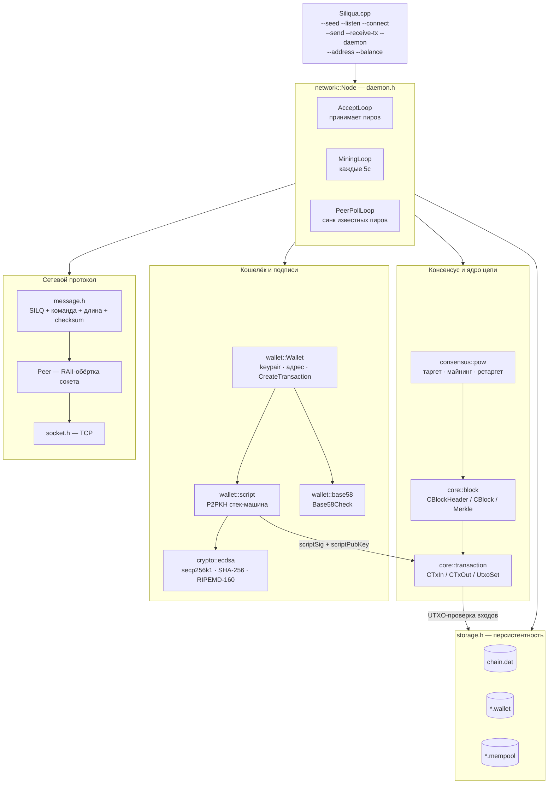
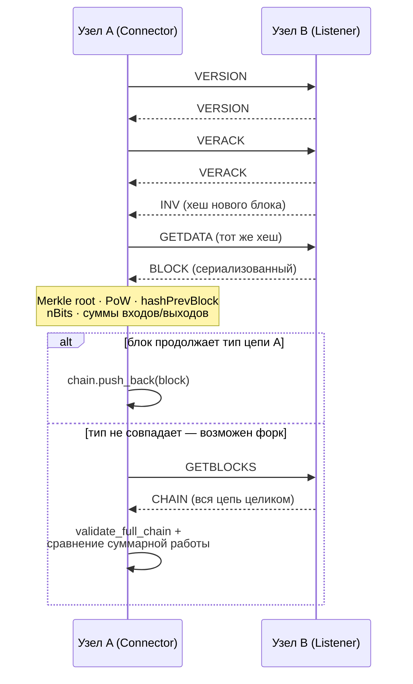

# 📘 Техническая документация блокчейн-платформы «Siliqua»

*English version: [ARCHITECTURE.en.md](ARCHITECTURE.en.md) · интерактивная HTML-схема: [architecture.ru.html](architecture.ru.html)*

## Чек-лист реализованных возможностей

### Криптография и адреса
✅ Генерация keypair (secp256k1): seckey/pubkey/сжатый pubkey
✅ ECDSA-подпись и верификация подписи
✅ SHA-256 / двойной SHA-256 / RIPEMD-160 хеширование
✅ Вывод адреса из pubkey (RIPEMD160(SHA256(pubkey)))
✅ Base58Check-кодирование адресов (собственный version byte 0x1E)

### Ядро цепи (core)
✅ Структуры транзакции: COutPoint, CTxIn, CTxOut, Transaction
✅ Двойной SHA-256 хеш транзакции и блока (GetHash)
✅ Сериализация/десериализация транзакций и блоков в бинарный формат
✅ Merkle Root и его проверка (IsMerkleRootValid)
✅ UTXO-модель (unordered_map<COutPoint, CTxOut> для O(1)-поиска)

### Консенсус и экономика
✅ Proof-of-Work: компактный target (nBits) ↔ 256-битный target
✅ Майнинг блока (перебор nNonce, роллинг nTime при переполнении)
✅ Ретаргет сложности (аналог правила Bitcoin, клампинг [0.25x, 4x])
✅ Расчёт суммарной работы цепи (chain work) для выбора форка
✅ Полная валидация цепи с нуля (validate_full_chain)
✅ Комиссии (fee) как разница между суммой входов и выходов
✅ Halving награды за блок (аналог 210 000 блоков Bitcoin, уменьшенный масштаб)

### Скрипты и кошелёк
✅ P2PKH scriptPubKey / scriptSig (OP_DUP, OP_HASH160, OP_EQUALVERIFY, OP_CHECKSIG)
✅ Стековая машина выполнения скриптов (script::evaluate)
✅ Класс Wallet: хранение ключей, адрес, сборка и подпись транзакций
✅ Выбор UTXO (greedy) с формированием сдачи и dust-порогом

### Сетевой протокол (P2P)
✅ Собственный бинарный протокол поверх TCP (magic bytes "SILQ")
✅ Кадрирование сообщений: magic + команда + длина + checksum
✅ Команды: VERSION, VERACK, INV, GETDATA, BLOCK, TX, GETBLOCKS, CHAIN
✅ Класс Peer (RAII-обёртка сокета)
✅ Кроссплатформенные сокеты (Winsock/POSIX) через единый интерфейс

### Узел (Node) и демон
✅ Разовые CLI-операции: run_listener, run_connector, run_send_tx, run_receive_tx
✅ Постоянный многопоточный демон (network::Node): AcceptLoop, MiningLoop, PeerPollLoop
✅ Мемпул с ограничением размера (MAX_MEMPOOL_SIZE)
✅ Приём и валидация чужих блоков, продолжение цепи (try_extend_chain)
✅ Разрешение форков по суммарной работе (try_reorg), а не по длине цепи
✅ Мультипир-режим демона (список известных пиров, периодическая синхронизация)

### Хранилище
✅ Бинарная (де)сериализация всей цепи в файл
✅ Персистентность UTXO-сета в файл
✅ Персистентность мемпула в файл
✅ Персистентность кошелька (seckey) в файл, восстановление между запусками

### CLI
✅ `--seed`, `--listen`, `--connect`, `--address`, `--balance`, `--send`, `--receive-tx`, `--daemon`

### Сборка
✅ Кроссплатформенный CMake (Windows/Linux/macOS), C++23
✅ Поиск secp256k1 и Crypto++ через pkg-config / vcpkg-style libs
✅ Оптимизация под слабое/старое железо (-O2 вместо -O3)

---

## Глава 1: Введение

### Название проекта
Siliqua — прототип одноранговой (P2P) блокчейн-платформы в духе Bitcoin, написанный на чистом C++ без внешних блокчейн-фреймворков.

### Цель проекта
Воспроизвести ключевые архитектурные и алгоритмические паттерны Bitcoin (UTXO, Proof-of-Work, P2P-протокол, скрипты, halving, комиссии) в компактной, читаемой кодовой базе, оптимизированной для запуска на слабом/старом оборудовании.

### Технологический стек

| Компонент             | Технологии                                                         |
| ---------------------- | ------------------------------------------------------------------- |
| Язык / стандарт        | C++23                                                                |
| Криптография (ECDSA)   | libsecp256k1                                                        |
| Хеширование            | picosha2 (SHA-256), Crypto++ (RIPEMD-160)                           |
| Сеть                   | сырые TCP-сокеты (POSIX / Winsock), собственный бинарный протокол   |
| Логирование            | spdlog                                                               |
| Сборка                 | CMake ≥ 3.15, кроссплатформенно (Windows / Linux / macOS)            |
| Хранилище              | плоские бинарные файлы (chain.dat, *.wallet, *.mempool)             |

### Основные функции платформы
- Генерация кошелька (keypair secp256k1) и Base58Check-адреса
- Отправка и приём подписанных транзакций с комиссией
- Майнинг блоков с Proof-of-Work и наградой за блок (с halving)
- Проверка входящих блоков и транзакций (подписи, UTXO, суммы)
- Разрешение форков по суммарной работе цепи (а не по длине)
- Постоянно работающий узел (демон), синхронизирующийся с несколькими пирами
- Персистентность цепи, UTXO, мемпула и кошелька между запусками

### Пройденные этапы разработки
На основе истории коммитов репозитория:

| Этап                                       | Ключевые результаты |
| -------------------------------------------- | -------------------- |
| Инициализация проекта, кроссплатформенный CMake | Windows/Linux/macOS сборка |
| Криптографический слой                     | ECDSA (seckey/pubkey/подпись/верификация), генерация адреса |
| Ядро: транзакции и блоки                   | COutPoint/CTxIn/CTxOut, CBlockHeader/CBlock, Merkle Root |
| Consensus: Proof-of-Work                   | compact target ↔ 256-бит, майнинг, проверка PoW |
| Персистентность                            | сериализация/десериализация цепи и UTXO в файлы |
| P2P-протокол                               | сообщения, рукопожатие VERSION/VERACK, сокеты |
| Первый обмен блоками между узлами          | Listener/Connector, генератор тестовых транзакций |
| Кошельки и подписи                         | класс Wallet, генератор уникальных кошельков, отдельные UTXO по адресам |
| Экономика сети                             | комиссии, halving, лимит мемпула |
| Реальные скрипты Bitcoin                   | scriptPubKey/scriptSig, стековая машина P2PKH |
| Мультипир-демон                            | многопоточный Node (Accept/Mining/PeerPoll), Base58-адреса |

---

## Глава 2: Архитектурная схема

Прототип блокчейна в духе Bitcoin: собственный формат блоков и транзакций, Proof-of-Work с ретаргетом сложности, UTXO-модель со скриптами P2PKH, secp256k1-подписи и бинарный P2P-протокол поверх сырых TCP-сокетов — без единой внешней ноды или блокчейн-фреймворка.

### Компоненты системы
- **CLI (`Siliqua.cpp`):** разбор флагов запуска, диспетчеризация на разовые операции или демон.
- **`network::Node` (демон, `daemon.h`):** три потока — приём пиров, майнинг по таймеру, опрос известных пиров, общая цепь под `std::mutex`.
- **Consensus (`consensus/pow.h`):** compact target, майнинг, ретаргет сложности, суммарная работа цепи.
- **Core (`core/block.h`, `core/transaction.h`):** структуры блока и транзакции, Merkle Root, UTXO-сет.
- **Wallet (`wallet/*.h`):** ключи, адреса (Base58Check), сборка и подпись транзакций, P2PKH-скрипты.
- **Crypto (`crypto/ecdsa.h`):** обёртка над secp256k1 и хеш-функциями.
- **Network (`network/*.h`):** кадрирование сообщений, TCP-сокеты, класс `Peer`.
- **Storage (`storage/storage.h`):** бинарная персистентность цепи/UTXO/мемпула/кошелька в файлы.

### Граф зависимостей и потоков управления



**Легенда:** узлы — модули/классы кодовой базы; сплошные стрелки — прямые вызовы/зависимости; пунктирная стрелка `-->|label|` — проверка/сверка данных между слоями; прямоугольник-цилиндр — файл на диске.

### Модули по слоям

| Файл                          | Слой                    | Что делает |
| ------------------------------- | ------------------------ | ------------ |
| `consensus/pow.h`               | Proof-of-Work            | Компактная сложность → 256-битный таргет, майнинг перебором nNonce, ретаргет каждые 5 блоков (цель — 60с), суммарная работа цепи для выбора форка. |
| `core/block.h` · `transaction.h`| Блоки и UTXO             | Заголовок из 6 полей, double-SHA256 хеш, Merkle Root по транзакциям; UTXO — `unordered_map<COutPoint, CTxOut>` для O(1)-поиска входов. |
| `wallet/script.h`               | Скрипты P2PKH            | Стековая машина на 4 опкодах (DUP, HASH160, EQUALVERIFY, CHECKSIG) — тот же принцип, что и в реальном Bitcoin Script, но только необходимый минимум. |
| `wallet/base58.h`               | Адреса Base58Check       | RIPEMD160(SHA256(pubkey)) + версия-байт 0x1E + 4-байтная контрольная сумма — собственный префикс, отличный от настоящего Bitcoin. |
| `network/message.h`             | Кадрирование сообщений   | Magic `SILQ` + команда (12 байт) + длина + 4-байтная checksum (double-SHA256 payload) — защита от чужого и повреждённого трафика. |
| `network/daemon.h`              | Постоянный узел          | Три потока вокруг одной цепи под `std::mutex`: приём пиров, майнинг по таймеру, опрос известных пиров — без внешнего планировщика. |

### Рукопожатие и обмен блоком между двумя узлами

Тот же цикл запросов, что использует `run_connector`: если полученный блок не продолжает собственный тип цепи, узел не отбрасывает его сразу — запрашивает всю цепь пира и сравнивает суммарную работу (правило Bitcoin: побеждает не самая длинная цепь, а цепь с наибольшей работой).



### Основные модули-«контроллеры»
- **`network::Node` (`daemon.h`):** постоянный демон — приём соединений, майнинг, синхронизация с пирами.
- **`run_listener` / `run_connector` (`node.h`):** разовый обмен одним блоком между двумя узлами (используется CLI-флагами `--listen`/`--connect`).
- **`run_send_tx` / `run_receive_tx` (`node.h`):** отправка подписанной транзакции пиру / приём транзакции в мемпул.
- **`storage::*` (`storage.h`):** сохранение и загрузка цепи, UTXO-сета, мемпула.

Полная таблица экономических констант, показанных на диаграммах, — в [Главе 10](#глава-10-экономика-и-лимиты-сети).

---

## Глава 3: Криптография и адреса

### Хеш-функции и подпись (`crypto/ecdsa.h`)
```cpp
namespace crypto {
    inline void hash_sha256(const std::vector<uint8_t>& input, std::array<uint8_t, 32>& output);
    inline void hash_double_sha256(const std::vector<uint8_t>& input, std::array<uint8_t, 32>& output);
    inline void hash_ripemd160(unsigned char* ripemd160_hash, unsigned char* input, size_t len);

    int generate_keypair(std::string input, std::vector<std::string>& keypair,
        unsigned char* seckey, secp256k1_pubkey& pubkey, unsigned char* compressed_pubkey);
    int create_address_from_pubkey(unsigned char* compressed_pubkey,
        unsigned char* ripemd160_hash, std::string& ripemd160_hash_string);
    int generate_sign(std::string input, unsigned char* seckey,
        unsigned char* serialized_signature, std::string& str_signature,
        secp256k1_ecdsa_signature& sig, unsigned char* input_hash);
    int verify_sign(secp256k1_ecdsa_signature& sig, unsigned char* serialized_signature,
        secp256k1_pubkey& pubkey, unsigned char* compressed_pubkey, unsigned char* input_hash);
}
```
Адрес = `RIPEMD160(SHA256(compressed_pubkey))`, 20 байт (`wallet::ADDRESS_SIZE`).

### Base58Check-адреса (`wallet/base58.h`)
Тот же алгоритм, что и в реальном Bitcoin: алфавит без похожих символов (0/O, I/l) + контрольная сумма для защиты от опечаток. Собственный version byte, чтобы адрес Siliqua никогда не спутать с настоящим Bitcoin-адресом:
```cpp
constexpr uint8_t ADDRESS_VERSION_BYTE = 0x1E;

inline std::string encode_address(const std::array<uint8_t, ADDRESS_SIZE>& address) {
    std::vector<uint8_t> payload;
    payload.push_back(ADDRESS_VERSION_BYTE);
    payload.insert(payload.end(), address.begin(), address.end());

    std::array<uint8_t, 32> checksum{};
    crypto::hash_double_sha256(payload, checksum);
    payload.insert(payload.end(), checksum.begin(), checksum.begin() + 4);

    return base58_encode(payload);
}
```
`decode_address()` — обратная операция, с проверкой версии и контрольной суммы (бросает исключение при опечатке).

### Подпись сообщений (`wallet/signing.h`)
```cpp
constexpr size_t SIGNATURE_SIZE = 64; // secp256k1 compact signature
constexpr size_t PUBKEY_SIZE = 33;    // сжатый pubkey

std::vector<uint8_t> sign_raw(const unsigned char seckey[32], const std::array<uint8_t, 32>& sighash);
bool verify_raw_signature(const std::vector<uint8_t>& sig_bytes,
    const std::vector<uint8_t>& pubkey_bytes, const std::array<uint8_t, 32>& sighash);
```
Подписывается хеш транзакции, посчитанный **при всех пустых `scriptSig`** (аналог `SIGHASH_ALL` в Bitcoin) — подпись не может зависеть от собственных байт.

---

## Глава 4: Транзакции и UTXO-модель

### Структуры (`core/transaction.h`)

| Структура     | Поля                                               | Назначение                              |
| ------------- | ---------------------------------------------------- | ----------------------------------------- |
| `COutPoint`   | `txid[32]`, `n`                                       | указатель на конкретный выход прошлой tx |
| `CTxIn`       | `prevout`, `scriptSig`, `nSequence`                   | вход — тратит один UTXO                  |
| `CTxOut`      | `nValue` (сатоши), `scriptPubKey`                     | выход — новый неподтверждённый остаток   |
| `Transaction` | `nVersion`, `vin`, `vout`, `nLockTime`, `tx_hash`     | вся транзакция                           |

```cpp
// outpoint -> unspent output. O(1)-поиск вместо O(log n) у std::map —
// именно эта структура сильнее всего нагружается по мере роста цепи.
using UtxoSet = std::unordered_map<COutPoint, CTxOut, COutPointHash>;
```

### Хеш и Coinbase
```cpp
std::array<uint8_t, 32> Transaction::GetHash() const;  // двойной SHA-256 сериализованной tx
bool Transaction::IsCoinbase() const;                    // первая tx в блоке — награда майнеру
```

### Построение UTXO-сета из всей цепи (`network/node.h`)
```cpp
inline transaction::UtxoSet build_utxo_set(const std::vector<block::CBlock>& chain) {
    transaction::UtxoSet utxos;
    for (const auto& blk : chain)
        for (const auto& tx : blk.vtx)
            for (uint32_t i = 0; i < tx.vout.size(); ++i)
                utxos.emplace(transaction::COutPoint(tx.tx_hash, i), tx.vout.at(i));
    for (const auto& blk : chain)
        for (const auto& tx : blk.vtx)
            for (const auto& in : tx.vin)
                utxos.erase(in.prevout);
    return utxos;
}
```

### Проверка транзакции и вычисление комиссии
```cpp
// fee (>= 0), если tx валидна; -1, если нет.
inline int64_t validate_and_get_fee(const transaction::Transaction& tx, const transaction::UtxoSet& utxo_set) {
    int64_t input_total = 0;
    for (size_t i = 0; i < tx.vin.size(); ++i) {
        auto it = utxo_set.find(tx.vin.at(i).prevout);
        if (it == utxo_set.end() || !wallet::verify_transaction_signature(tx, i, it->second.scriptPubKey))
            return -1;
        input_total += it->second.nValue;
    }
    int64_t output_total = 0;
    for (const auto& out : tx.vout) output_total += out.nValue;
    if (output_total > input_total) return -1;
    return input_total - output_total; // разница = комиссия
}
```

---

## Глава 5: Блоки и Proof-of-Work

### Заголовок блока (`core/block.h`)
```cpp
struct CBlockHeader {
    int32_t nVersion;
    std::array<uint8_t, 32> hashPrevBlock;
    std::array<uint8_t, 32> hashMerkleRoot;
    uint32_t nTime;
    uint32_t nBits;   // компактный target
    uint32_t nNonce;

    std::array<uint8_t, 32> GetHash() const; // двойной SHA-256
};

class CBlock : public CBlockHeader {
public:
    std::vector<transaction::Transaction> vtx;
    std::array<uint8_t, 32> BuildMerkleRoot() const;
    bool IsMerkleRootValid() const;
    bool IsValid() const;
};
```

### Compact target ↔ 256-бит (`consensus/pow.h`)
Верхний байт `nBits` — экспонента (длина в байтах), младшие 3 байта — мантисса. Та же схема, что и в Bitcoin:
```cpp
inline std::array<uint8_t, 32> bits_to_target(uint32_t bits);
inline bool check_proof_of_work(const block::CBlockHeader& header); // hash <= target
inline void mine_block(block::CBlockHeader& header, uint32_t nBitsTarget); // перебор nNonce
```

### Ретаргет сложности
```cpp
constexpr uint32_t RETARGET_INTERVAL = 5;         // блоков между пересчётами
constexpr uint32_t TARGET_TIMESPAN_SECONDS = 60;  // ожидаемое время на интервал
constexpr uint32_t INITIAL_BITS = 0x207fffff;

// actual_timespan клампится в [target/4, target*4] — всплеск быстрых/медленных
// блоков не может сдвинуть сложность больше чем в 4 раза за один ретаргет.
uint32_t get_next_work_required(const std::vector<block::CBlockHeader>& headers,
    uint32_t retarget_interval, uint32_t target_timespan_seconds);
```

### Выбор форка — по суммарной работе, а не по длине
```cpp
double calculate_block_work(uint32_t nBits);              // 2^256 / target
double calculate_chain_work(const std::vector<block::CBlockHeader>& headers);
```
Ключевое правило Bitcoin, воспроизведённое здесь: побеждает цепь с наибольшей **суммарной работой** (`try_reorg` в `node.h`), а не просто более длинная — обычно это совпадает, но не всегда.

### Награда за блок и halving (`network/node.h`)
```cpp
constexpr int64_t INITIAL_REWARD = 5000000000; // 50 монет, блок 0
constexpr uint32_t HALVING_INTERVAL = 10;       // блоков на halving (для наглядности теста)

inline int64_t calculate_block_reward(uint32_t height) {
    uint32_t halvings = height / HALVING_INTERVAL;
    if (halvings >= 63) return 0;
    return INITIAL_REWARD >> halvings;
}
```
Coinbase-вход кодирует высоту блока в `scriptSig` (аналог Bitcoin BIP34) — иначе два блока с одинаковой наградой от одного адреса дали бы идентичный `tx_hash` и столкнулись бы в UTXO-сете.

---

## Глава 6: Скрипты P2PKH

### Опкоды (`wallet/script.h`)

| Опкод            | Код    | Действие                                                    |
| ----------------- | ------ | -------------------------------------------------------------- |
| `OP_DUP`          | `0x76` | дублирует верх стека                                          |
| `OP_HASH160`      | `0xa9` | `RIPEMD160(SHA256(x))` верха стека                             |
| `OP_EQUALVERIFY`  | `0x88` | сравнивает два верхних элемента, обрывает при несовпадении     |
| `OP_CHECKSIG`     | `0xac` | проверяет подпись против sighash                                |

### Построение скриптов
```cpp
// OP_DUP OP_HASH160 <push 20-byte address> OP_EQUALVERIFY OP_CHECKSIG
std::vector<uint8_t> build_p2pkh_script_pubkey(const std::array<uint8_t, wallet::ADDRESS_SIZE>& address);

// <push signature><push pubkey>
std::vector<uint8_t> build_script_sig(const std::vector<uint8_t>& signature, const std::vector<uint8_t>& pubkey);
```

### Выполнение (стековая машина)
`scriptSig` и `scriptPubKey` конкатенируются и выполняются как одна программа — так же, как в настоящем Bitcoin. Трата валидна, если на стеке в конце остаётся ровно одно истинное значение:
```cpp
bool evaluate(const std::vector<uint8_t>& script_sig,
    const std::vector<uint8_t>& script_pubkey, const std::array<uint8_t, 32>& sighash);
```
Это не полный Bitcoin Script (~100 опкодов), а минимум, необходимый для классического P2PKH.

---

## Глава 7: Сетевой протокол (P2P)

### Формат кадра сообщения (`network/message.h`)

| Поле       | Размер     | Описание                                          |
| ----------- | ---------- | ------------------------------------------------------ |
| magic       | 4 байта    | `"SILQ"` — не спутать с реальным Bitcoin-трафиком      |
| command     | 12 байт    | имя команды, дополненное нулями                        |
| length      | 4 байта LE | длина payload                                           |
| checksum    | 4 байта    | первые 4 байта double-SHA256(payload)                   |
| payload     | переменная | тело сообщения                                          |

```cpp
inline constexpr std::array<uint8_t, 4> MAGIC_BYTES = { 'S', 'I', 'L', 'Q' };
inline constexpr uint32_t MAX_PAYLOAD_SIZE = 4 * 1024 * 1024; // защита от враждебного length
```

### Команды протокола

| Команда      | Направление                        | Назначение                                     |
| ------------- | ------------------------------------ | ------------------------------------------------- |
| `version`     | инициатор → получатель               | согласование версии протокола                     |
| `verack`      | получатель → инициатор               | подтверждение рукопожатия                          |
| `inv`         | listener → connector                 | анонс хеша нового блока                            |
| `getdata`     | connector → listener                 | запрос блока по хешу                               |
| `block`       | listener → connector                 | сериализованный блок                               |
| `tx`          | отправитель → получатель             | подписанная транзакция для мемпула                 |
| `getblocks`   | connector → listener                 | запрос всей цепи (для разрешения форка)            |
| `chain`       | listener → connector                 | вся цепь целиком (`storage::serialize_chain`)      |

### Класс Peer — RAII-обёртка сокета (`network/peer.h`)
```cpp
class Peer {
public:
    explicit Peer(socket_t sock) : sock_(sock) {}
    ~Peer() { close_socket(sock_); }
    Peer(const Peer&) = delete; // у сокета ровно один владелец

    bool Send(const std::string& cmd, const std::vector<uint8_t>& payload) const;
    bool Receive(Message& out) const;
};
```
Сокеты кроссплатформенные (`network/socket.h`): Winsock на Windows, стандартные POSIX-сокеты на Linux/macOS через единый интерфейс `create_listener` / `connect_to` / `accept_connection`.

---

## Глава 8: Узел — CLI-режимы и постоянный демон

### Разовые операции (`network/node.h`)
Каждая функция выполняет ровно один обмен с ровно одним пиром и завершается — удобно для CLI и тестирования:

| Функция              | Что делает                                                                       |
| ---------------------- | ----------------------------------------------------------------------------------- |
| `run_listener`         | добывает новый блок поверх своей цепи, слушает порт, обслуживает одного пира       |
| `run_connector`        | подключается к пиру, забирает блок; если он не продолжает свой тип — запрашивает всю цепь пира и сравнивает суммарную работу |
| `run_send_tx`          | собирает и подписывает транзакцию из своих UTXO, отправляет пиру в мемпул          |
| `run_receive_tx`       | принимает одну транзакцию, проверяет подпись/UTXO, кладёт в мемпул                |

### Постоянный демон `network::Node` (`network/daemon.h`)
Те же строительные блоки (`build_next_block`, `try_extend_chain`, `try_reorg`, `validate_and_get_fee`), но работающие непрерывно, а не один раз:

```cpp
class Node {
public:
    Node(uint16_t listen_port, const std::string& chain_path, std::vector<PeerAddress> known_peers);
    [[noreturn]] void Run(); // запускает 3 потока и никогда не возвращает управление

private:
    [[noreturn]] void AcceptLoop();    // принимает пиров, каждого — в отдельном detached-потоке
    void HandleConnection(socket_t client_sock);
    void AcceptTransaction(const transaction::Transaction& tx, const std::string& prefix);
    [[noreturn]] void MiningLoop();    // раз в DAEMON_CYCLE_SECONDS добывает блок из мемпула
    [[noreturn]] void PeerPollLoop();  // раз в DAEMON_CYCLE_SECONDS опрашивает known_peers_
    void PollPeer(const PeerAddress& addr);

    std::mutex mutex_;                 // защищает chain_ от гонок между тремя циклами
    std::vector<block::CBlock> chain_;
};
```

### Приём блока и разрешение форка
```cpp
bool try_extend_chain(std::vector<block::CBlock>& chain, const block::CBlock& received_block);
bool try_reorg(std::vector<block::CBlock>& chain, const std::vector<block::CBlock>& peer_chain);
bool validate_full_chain(const std::vector<block::CBlock>& chain); // с нуля, от genesis
```
Полная последовательность обмена показана на диаграмме в [Главе 2](#глава-2-архитектурная-схема) (рукопожатие и обмен блоком).

---

## Глава 9: Хранилище (`storage/storage.h`)

| Файл                    | Формат                                                                       |
| ------------------------- | --------------------------------------------------------------------------- |
| `<chain_path>`             | количество блоков (varint) + `Serialize()` каждого блока подряд             |
| `<chain_path>.wallet`      | 32 сырых байта seckey                                                       |
| `<chain_path>.mempool`     | количество tx (varint) + `Serialize()` каждой транзакции подряд             |
| `<любой>.utxo`             | количество записей (varint) + пары `COutPoint::Serialize()`+`CTxOut::Serialize()` |

```cpp
void save_chain(const std::vector<block::CBlock>& chain, const std::string& path);
std::vector<block::CBlock> load_chain(const std::string& path);
void save_mempool(const std::vector<transaction::Transaction>& mempool, const std::string& path);
std::vector<transaction::Transaction> load_mempool(const std::string& path);
```
Один и тот же `serialize_chain()`/`deserialize_chain()` используется и для файла, и для сетевого сообщения `CHAIN` — один формат, два носителя.

---

## Глава 10: Экономика и лимиты сети

| Константа                  | Значение          | Смысл                                                     | Файл                  |
| ---------------------------- | ------------------ | ------------------------------------------------------------ | ----------------------- |
| `INITIAL_REWARD`             | 5 000 000 000      | 50 монет — награда за блок 0, до halving                     | `network/node.h`        |
| `HALVING_INTERVAL`           | 10 блоков          | награда делится пополам каждые N блоков                      | `network/node.h`        |
| `DEFAULT_FEE`                | 1000 сатоши        | фиксированная комиссия `run_send_tx`                          | `network/node.h`        |
| `RETARGET_INTERVAL`          | 5 блоков           | как часто пересчитывается сложность                          | `network/node.h`        |
| `TARGET_TIMESPAN_SECONDS`    | 60 с               | ожидаемое время на `RETARGET_INTERVAL` блоков                 | `network/node.h`        |
| `MAX_MEMPOOL_SIZE`           | 1000 tx            | потолок неподтверждённых транзакций                           | `network/node.h`        |
| `DUST_THRESHOLD`             | 1000 сатоши        | сдача меньше этого не выделяется в отдельный UTXO             | `wallet/wallet.h`       |
| `DAEMON_CYCLE_SECONDS`       | 5 с                | период циклов MiningLoop и PeerPollLoop                       | `network/daemon.h`      |
| `ADDRESS_VERSION_BYTE`       | `0x1E`             | собственный префикс адреса (не Bitcoin mainnet)               | `wallet/base58.h`       |
| `MAGIC_BYTES`                | `"SILQ"`           | отличает трафик Siliqua от настоящего Bitcoin P2P              | `network/message.h`     |

Значения намеренно небольшие (halving за 10 блоков, ретаргет за 5) — поведение можно наблюдать за один тестовый прогон, а не за годы, как в реальном Bitcoin.

---

## Глава 11: CLI — команды и сценарий из двух узлов

### Справка по флагам (`src/Siliqua.cpp`)

| Команда                                                          | Назначение                                                        |
| -------------------------------------------------------------------- | ------------------------------------------------------------------ |
| `Siliqua --seed <path>`                                              | добыть чистую genesis-цепь (нейтральный адрес) и сохранить         |
| `Siliqua --listen <port> [chain_path]`                                | добыть блок поверх `chain_path`, обслужить одного пира             |
| `Siliqua --connect <host> <port> [chain_path]`                        | забрать блок у пира и, если валиден, добавить в `chain_path`       |
| `Siliqua --address <chain_path>`                                      | напечатать адрес кошелька узла (Base58Check)                       |
| `Siliqua --balance <chain_path>`                                      | напечатать свои UTXO и их сумму                                    |
| `Siliqua --send <host> <port> <chain_path> <address> <amount>`        | подписать трату и отправить пиру в мемпул                          |
| `Siliqua --receive-tx <port> <chain_path>`                            | принять одну транзакцию от пира в мемпул                           |
| `Siliqua --daemon <port> <chain_path> [host:port ...]`                | запустить постоянный узел с (опционально) известными пирами        |

### Практический сценарий: два узла, один перевод
```bash
# 1. Узел A сеет genesis-цепь
./Siliqua --seed nodeA.dat

# 2. Узел B копирует ТОТ ЖЕ genesis ДО того, как A замайнит следующий блок —
#    run_connector требует уже существующую цепь с общим genesis, иначе
#    первый же полученный блок не свяжется по hashPrevBlock и будет отклонён.
cp nodeA.dat nodeB.dat

# 3. Узел A добывает блок 1 поверх своей цепи и слушает порт 9000
./Siliqua --listen 9000 nodeA.dat &

# 4. Узел B подключается, забирает блок 1 и дописывает его в свою копию цепи
./Siliqua --connect 127.0.0.1 9000 nodeB.dat

# 5. Смотрим адреса и баланс узла A (награда за блок 1 ушла на его кошелёк)
./Siliqua --address nodeA.dat
./Siliqua --address nodeB.dat
./Siliqua --balance nodeA.dat

# 6. Узел B слушает порт для приёма транзакции
./Siliqua --receive-tx 9001 nodeB.dat &

# 7. Узел A отправляет часть своего баланса на адрес узла B (адрес из шага 5)
./Siliqua --send 127.0.0.1 9001 nodeA.dat <адрес_узла_B> 100000

# 8. Постоянный демон вместо разовых команд, с известным пиром
./Siliqua --daemon 9000 nodeA.dat 127.0.0.1:9001
```

---

## Глава 12: Сборка проекта

### Зависимости
- CMake ≥ 3.15, компилятор с поддержкой C++23
- `libsecp256k1` (`brew install secp256k1` / `apt-get install libsecp256k1-dev`)
- `libcryptopp` (`brew install cryptopp` / `apt-get install libcrypto++-dev`)
- На Windows зависимости ожидаются в `Siliqua/libs/` (`libsecp256k1.lib`, `cryptlib.lib`)

### Сборка (Linux / macOS)
```bash
mkdir -p build && cd build
cmake ..
cmake --build . --config Release
```
Бинарник появляется в `Siliqua/bin/Siliqua` (`RUNTIME_OUTPUT_DIRECTORY`).

### Особенности CMakeLists.txt
```cmake
set(CMAKE_CXX_STANDARD 23)
set(CMAKE_CXX_STANDARD_REQUIRED ON)

# Однопроходные генераторы (Make/Ninja) по умолчанию не оптимизируют, если
# не указан build type явно - форсируем Release, чтобы `cmake .. && cmake --build .`
# сразу давал оптимизированный бинарник.
if(NOT CMAKE_BUILD_TYPE AND NOT CMAKE_CONFIGURATION_TYPES)
    set(CMAKE_BUILD_TYPE Release CACHE STRING "Build type" FORCE)
endif()
```
`-O2` вместо `-O3` на GCC/Clang в Release — сознательный выбор ради совместимости со слабым/старым железом (без автовекторизации под инструкции, которых может не быть на целевом CPU).

### Threads
`network/daemon.h` использует `std::thread`; на Linux это требует `-lpthread`, что решается через `Threads::Threads` вместо ручного флага, специфичного для платформы.
